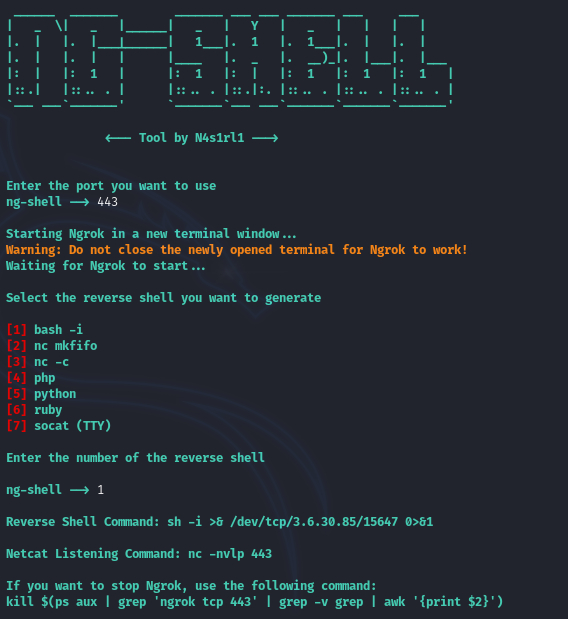

# Ngrok Reverse Shell Tool

## Description 

This Python tool allows you to create a reverse shell using Ngrok's public IP and port. It automates the process of starting Ngrok, fetching the tunnel's public URL, and generating various types of reverse shell commands. Once Ngrok is started, it gives you the ability to select from multiple reverse shell options, including `bash`, `netcat`, `php`, `python`, `ruby`, and `socat`. Additionally, it provides the necessary Netcat listener command and instructions to stop the Ngrok process.

## Features

* Automatically opens Ngrok in a new terminal.
* Fetches the public Ngrok URL and resolves the IP and port.
* Supports different reverse shell commands (bash, nc, php, python, ruby, socat).
* Provides a command to stop Ngrok when you're done.

## Installation & Usage

1. `git clone https://github.com/N4s1rl1/NG-SHELL.git`
2. `cd NG-SHELL`
3. `pip install -r requirements.txt`
4. `sudo python3 ng-shell.py`

## Screenshot

## Language

